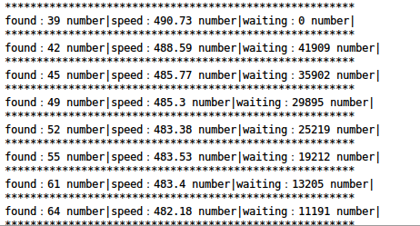

# Subdomain3

     

**README.md in [English](https://github.com/yanxiu0614/subdomain3/blob/master/README.md)**

## 描述
Subdomain3是新一代子域名爆破工具,它帮助渗透测试者相比与其他工具更快发现更多的信息,这些信息包括子域名,IP,CDN信息等,开始使用它吧!

## 截图
medium 模式下的截图:



## 特性

* 更快

三种速度模式. 用户也可以修改配置文件(/lib/config.py) 来获得更高的速度.
* CDN识别支持

可以判定域名是否使用了CDN,同时新增在某些情况下自动识别是否使用CDN，而不只依赖给定的列表；
* 标准C段支持

可以对未使用CDN的域名IP进行分类.
* 多级域名支持

可以发现多级域名,无限制.
* 大字典支持

可以支持百万级字典
* 更少的资源占用

1个CPU/1GB内存/1Mbps带宽 即可获得很高速度
* 更智能

自动发现最快的DNS服务器，并使用其进行爆破；优化泛解析策略，对抗dns污染；支持从其他渠道导入子域名，同时会将部分字段导入字典二次爆破，从而更准确。

## 开始

```
git clone https://github.com/yanxiu0614/subdomain3.git

pip install -r requirement.txt

python2/3 brutedns.py -d tagetdomain -s high -l 5
```
## 使用方法

Short Form    | Long Form      | Description
------------- | -------------  |-------------
-d            | --domain       | 目标域名,例如: baidu.com
-s            | --speed        | 速度模式,三种速度模式:fast,medium,low
-l            | --level        | 例子: 2:w.baidu.com; 3:w.w.baidu.com;
-f            | --file         | 使用文件,每行一个子域名
-ns           | --default_dns  | y为使用默认DNS；n为搜索最快的DNS；
-c            | --cname        | 开启CDN搜集,y或者n
-f1           | --sub_file     | 一级域名字典
-f2           | --next_sub_file| 二级域名字典
-f3           | --other_file   | 外部域名结果

## 致谢:

- <a href="https://github.com/smarttang" target="view_window">smarttang(Tangyucong)</a>
- <a href="https://security.yirendai.com/" target="view_window">宜人贷安全部</a>


## 日志:
- 2019-09-17:新增去重策略以对抗dns污染和泛解析的问题；修复了BUG等等；

- 2019-09-17:支持自动搜索最快的DNS；支持自动识别CDN；优化爆破过程降低占用；提高速度；更新了界面UI；修复BUG等等，总的来说，本次新增特性较多；

- 2018-11-6: 去除了在泛解析下的bug，优化了执行效率；删除资源耗费较高的去重策略。

- 2018-10-6: 优化了api的使用，支持模块的复用，从而可以内嵌到其他模块之中。优化了域名的去重策略，避免大量无效域名；

- 2018-2-14: 修复报错问题

- 2018-1-9: CDN搜集计划，增加搜集cname选项。

- 2017-11-11:支持导入其他渠道收集的子域名结果（约定文件名为：target_domain.log，并且与brutedns.py文件在同一目录下），程序会对结果进行字段提取加入字典，更加精确;API调用更加方便;

- 2017-10-26:优化过程;修复BUG

- 2017-10-11:重构了部分代码;支持API调用;结果更加易读;更新了CDN厂商;修改了扫描算法,更快速;删除了验证域名脚本;

- 2017-6-17: 删除了泛解析选项(-p t/f);添加了配置文件;优化了泛解析策略;

- 2017-5-2: 添加了域名验证选项;修复了泛解析bug;更新了CDN列表等;

- 2017-4-21: 优化了子域名的爆破策略;提升了速度;

- 2017-3-23: 添加了泛解析选项(-p t/f)

- 2017-3-17: 大字典支持.支持百万级;

- 2017-3-10: 添加了文件中域名爆破的支持;更新了CDN厂商;

- 2017-2-26: 多级域名支持,没有级数上限;较大字典支持;内存占用为原来四分之一;更快;

- 2017-2-24: 支持mac os等


&copy;<a href="https://github.com/monsterzer0" target="_blank">Monster Zero Team</a>  2019
